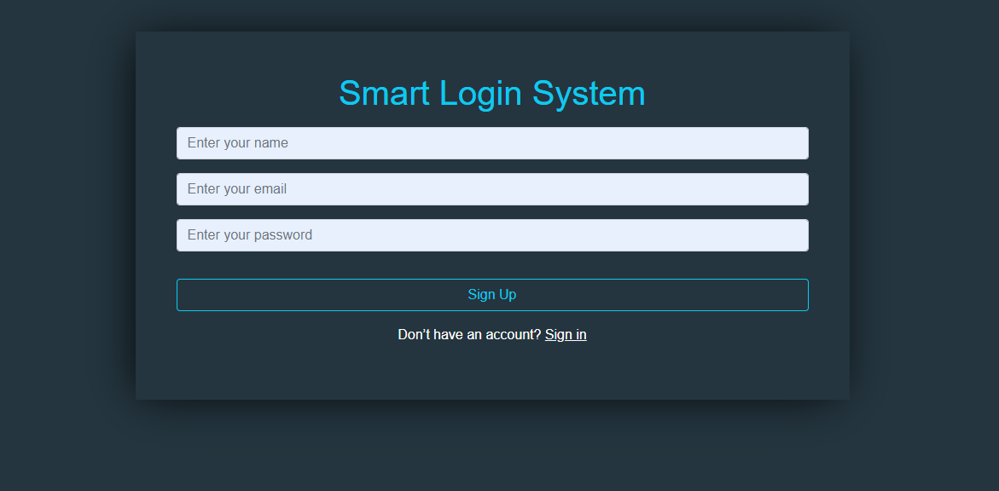

Bookmarker - project

This project demonstrates the registration of an account and documents the registration process with it, taking into account the validation process

* Done by HTML & CSS & bootstarp 5 & JavaScript & Local Storage & Doom 
* I used local storage to stor the data of users

This image shows the account registration process

This picture shows the process of logging in to the account

Logged in

